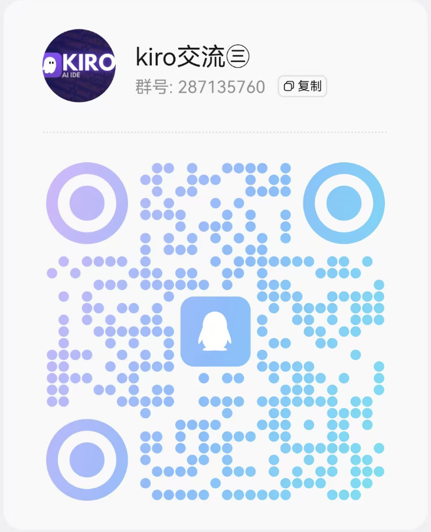
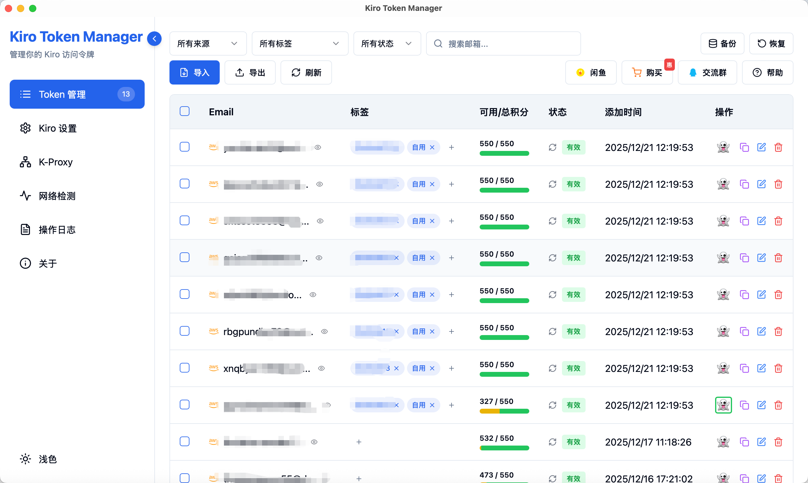
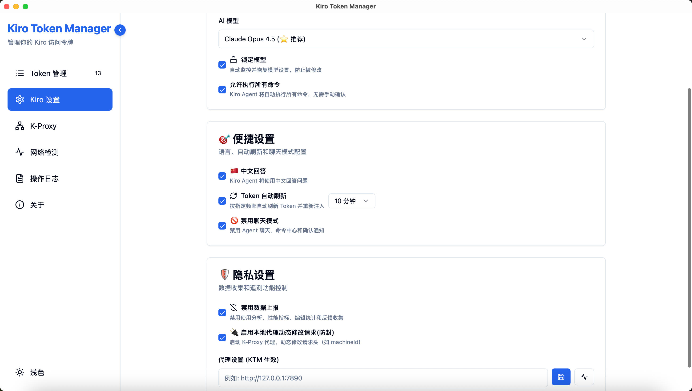
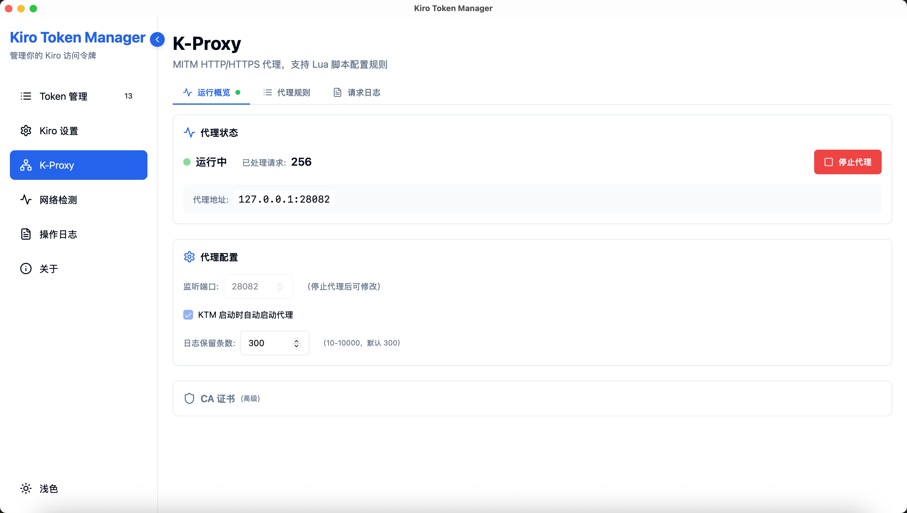
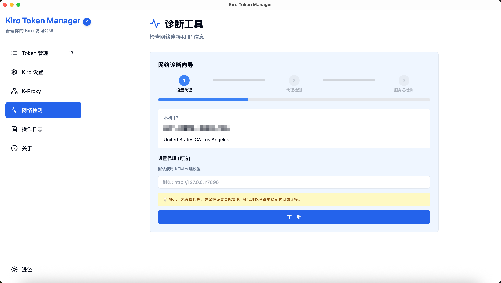
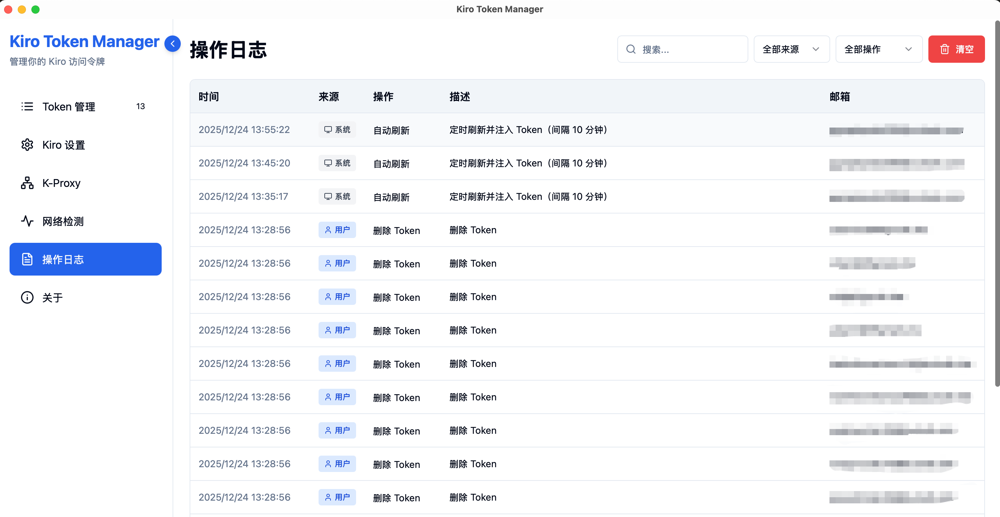
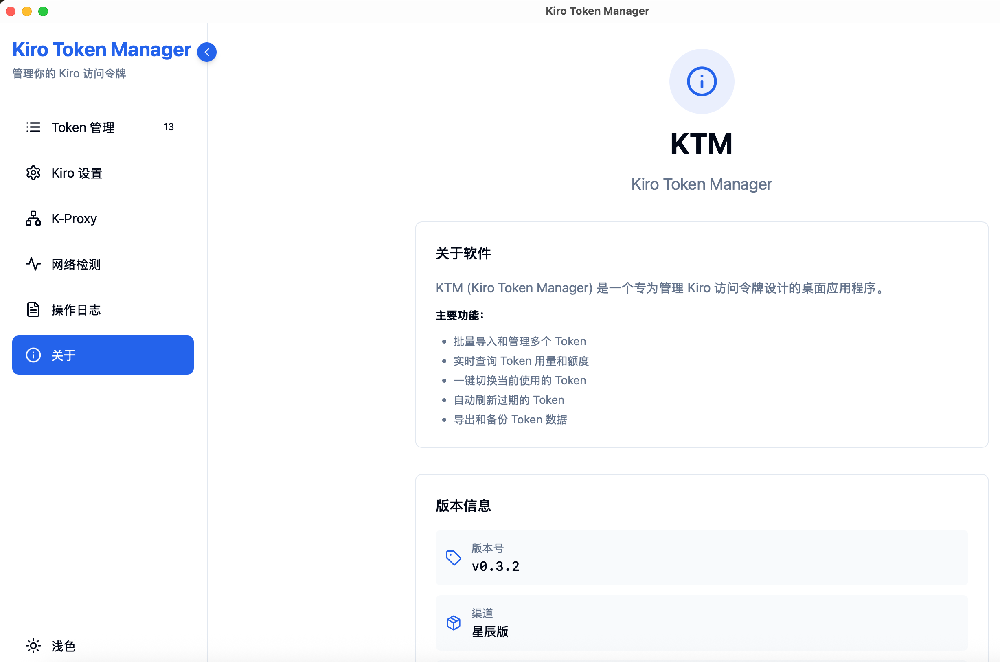

# Kiro Token Manager

一个专为管理 Kiro 访问令牌设计的桌面应用程序。
欢迎加QQ 群交流(287135760)

## 功能特性

- **批量管理** - 支持导入、导出和管理多个 Token
- **动态设备ID** - 支持通过 K-Proxy 动态修改设备 ID
- **用量查询** - 实时查询 Token 用量和额度信息
- **一键切换** - 快速切换当前使用的 Token
- **自动刷新** - 自动刷新过期的 Token，支持批量刷新
- **数据持久化** - 用量数据本地保存，离线也能查看
- **邮箱去重** - 导入时自动过滤重复邮箱的 Token
- **模型锁定** - 锁定 Kiro IDE 的 AI 模型选择，防止被意外修改
- **深色模式** - 支持深色主题

## 下载安装

前往 [Releases](../../releases) 页面下载最新版本。

### Windows
- `KiroTokenManager_版本_x64_portable.zip` - 便携版（需要系统已安装 WebView2）
- `KiroTokenManager_版本_x64_portable_full.zip` - 便携版完整版（内置 WebView2）

### macOS
- `KiroTokenManager_版本_aarch64.dmg` - Apple Silicon (M1/M2/M3/M4)
- `KiroTokenManager_版本_x64.dmg` - Intel

### Linux
- `KiroTokenManager_版本_amd64.deb` - Debian/Ubuntu
- `KiroTokenManager_版本_x86_64.rpm` - Fedora/RHEL

## 快速开始

1. 下载并安装应用
2. 点击"导入"按钮，粘贴 Token JSON 数据
3. 点击刷新按钮查询用量
4. 点击切换按钮使用 Token

## 常见问题

**Q: Token 从哪里获取？**  
A: Token 存储在 `~/.aws/sso/cache/kiro-auth-token.json` 文件中。

**Q: 切换 Token 后在哪里生效？**  
A: Token 会被写入到 Kiro 配置文件，IDE 会自动读取。

**Q: Token 过期了怎么办？**  
A: 点击刷新按钮，应用会自动刷新 Token。

## 系统要求

- Windows 10+ (x64)
- macOS 10.15+
- Linux (x64)

## 软件界面截图

